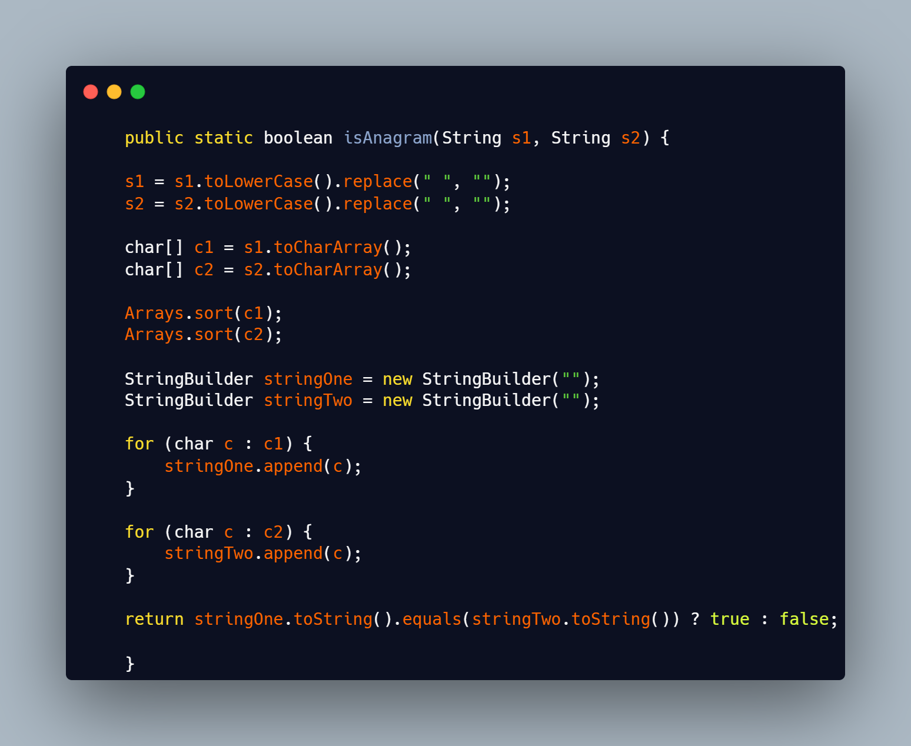

## OneHundred Leetcode Coding Challenges 
Going down to key concepts of Data Structires & Algorithms 
- HashMap
- LinkedList
- Binary Search
- StringBuilder
- Arrays
- Map.Entry(K,V)
- Regex[a-zA-Z0-9]\\s*
- Iterating Arrays and Lists 
- Collections
- Lambda
- Generics
- Classes
- OOP
## _Table of contents_
- [Overview](#overview)
- [Screenshot](#screenshot)
- [Links](#links)
- [Built with](#built-with)
- [What I practiced](#what-i-practiced)
- [Continued development](#continued-development)
- [Resources](#useful-resources)
- [Author](#author)
- [Acknowledgments](#acknowledgments)
## _Overview_
The file hierarchy is structured as shown:
- OneHundredChallenges
- src|
    - challengeOne.symmetricTree
    - challengeTwo.mergeTree
    - ...

## _Screenshot_
[]()
## _Links_
- Live Site URL: [] 
## _Built with_

  |  |  |  |  | 

 ## _What I practiced_
```java
import java.util.Arrays;
import java.util.HashMap;
import java.util.Map;

public class TwoSumHash {

    public static void main(String[] args) {

	  int target = 10;
	  int[] nums = { 1, 3, 5, 7, 9, 11, 15, 17 };

	  System.out.println(Arrays.toString(twoSum(nums, target)));

    }

    public static int[] twoSum(int nums[], int target) {

	  Map<Integer, Integer> map = new HashMap<Integer, Integer>();

	  int[] response = new int[2];

	  for (int k = 0; k < nums.length; k++) {

	    if (map.containsKey(nums[k])) {
		    response[0] = map.get(nums[k]);
		    response[1] = k;
		    return response;
	    }

	    map.put(target - nums[k], k);
	  }

	return response;

  }

}

``` 

## _Continued development_
- Next step: Keep moving forward 
### _Useful resources_
- [https://leetcode.com] LeetCode has gained popularity among job seekers and coding enthusiasts as a resource for technical interviews and coding competitions.
- [https://hackerrank.com/] HackerRank is a technology company that focuses on competitive programming challenges for both consumers and businesses. Developers compete by writing programs according to provided specifications.
- [https://freecodecamp.org] https://www.freecodecamp.org/news/the-most-popular-coding-challenge-websites
## _Author_
- Website - [https://ferreiras.dev.br] 
## Acknowledgments
- @devsuperior
